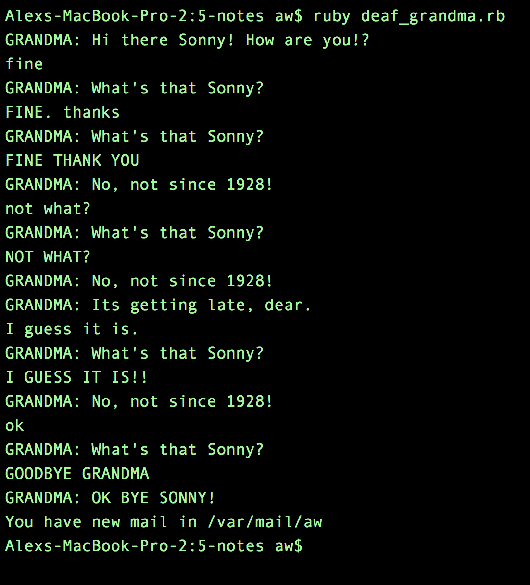

<!--
Creator: <Name>
Market: SF
-->

# Deaf Grandma + Sinatra Code Study

### Introduction

For homework tonight we are going to make a simple `command line` based program in ruby, your first ruby application! You also are going to take some time to review a Sinatra Application's Source Code! More on that on the bottom.

## Exercise

#### Requirements

- Create a ruby application that runs from a single ruby file `deaf_grandma.rb`
- When you run `ruby deaf_grandma.rb` in the terminal you should be greeted by grandma, and promted for some input.
- If your input is not in all caps, grandma should respond with "WHAT'S THAT SONNY?" and promt the user again.
- If your input IS in all caps, grandma should respond with "NO DEAR, NOT SINCE 1928!"

**Bonus:**
- Keep this `loop` going until the user inputs "GOODBYE GRANDMA"
- Every 5 questions Grandma get's asked she says "It's getting late, dear."
- After 20 questions Grandma only responds with "ZZZZZZ" (unless we say GOODBYE GRANDMA)
- Add some features of your own! Be creative!

#### Deliverable

Here's a screenshot of what we expect this to look like:

### Additional Resources

- [Ruby User Input](http://ruby-doc.org/docs/Tutorial/part_02/user_input.html)
- [Looping in Ruby](http://www.tutorialspoint.com/ruby/ruby_loops.htm)
- [Case in Ruby](http://ruby-doc.org/docs/keywords/1.9/Object.html#method-i-case)

## Sinatra App Source Code Review

Check out [this nifty little web app](http://gitscore.herokuapp.com/) that gives github repo's a score in a old-school gaming fashion! Its not the most useful app ever, but it is simple. It does one thing and does it well.

Once you have played with the app a little bit, check out the [source code](https://github.com/leereilly/github-high-scores). Start with the app.rb Think about the following questions:
- What's familiar?
- What isn't?
- What looks like good code?
- What doesn't?
- Is this MVC?

### Self Evaluation

During the previous exercise, rate your progress on a scale of 1-5 (5 being the highest) for the following criteria:

- **Persistence:** Do you handle frustration well? Do you independently pursue understanding?
- **Organization:** Do you thoughtfully implement best coding patterns and practices?
- **Collaboration:** Do you make an effort solve problems and share your ideas with others?
- **Communication:** Do you clearly convey your thoughts to others in illustrative and clear ways?
- **Self-compassion:** Do you make productive use of turning failures into learning opportunities?
- **Resourcefulness:** Do make an effort to compare and contrast new ideas with ones you already know?
